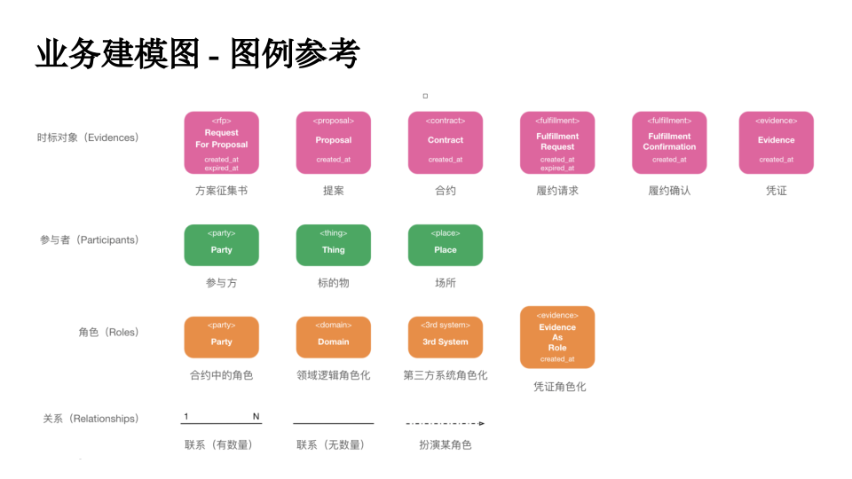
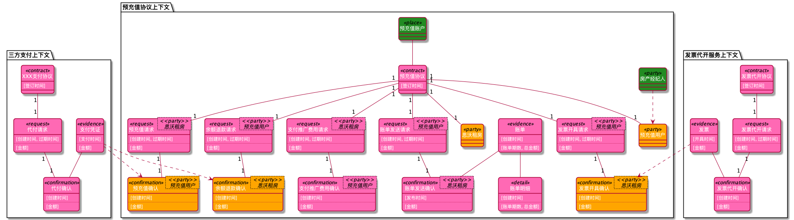

# 8x Flow 业务建模图DSL生成工具


## 介绍
手动绘制[8x Flow](https://huhao.dev/posts/2932e594/)业务建模图是低效痛苦，并且没有办法版本管理。虽然有一些[8x flow的建模图绘制工具](https://github.com/vincentx/8x-flow)，但是不支持语法检查，并且生成的图不够友好。因此我开发了此工具。此工具基于Kotlin语言，通过自定义DSL来友好的支持建模图生成。

目前此工具支持如下功能：

* **创建时标对象(Evidences)**：包括*方案征集书(RFP)、提案(Proposal)、合约(Contract)、履约请求(Fulfillment-Request)、 履约确认(Fulfillment-Confirmation)、凭证(Evidence)。*
* **创建参与者对象(Participants)**：*包括参与方(Party)、标的物(Thing)、场所(Place)。*
* **创建角色对象(Roles)**：包括*合约中的角色(Role)、领域逻辑角色化(Domain)、第三方系统角色化(3rd System)、凭证角色化(Evidence As Role)。*
* **创建关系**：*关联关系(1对1、1对N、无数量)；扮演角色关系。*  




## 快速开始

### 环境准备
clone [8x-flow-diagram](https://github.com/behring/8x-flow-diagram)的代码到本地后，通过[Intellij Idea](https://www.jetbrains.com/idea/)打开工程。

>注意：项目是通过PlantUML API生成建模图，如果生成图例失败，请查看是否安装了[GraphViz](https://plantuml.com/zh/graphviz-dot)

### 创建Helloword建模图

1. 在`8x-flow-diagram/src/main/kotlin`目录下创建hello-word-diagram.kts脚本文件。

2. 键入如下代码：

   ```kotlin
   import doxflow.dsl.diagram_8x_flow
   
   diagram_8x_flow {
       context("商品销售上下文") {
           contract("商品订单合同") {
               key_timestamps("签订时间")
           }
       }
   } export "../../../diagrams/hello-word-diagram.png"
   ```

3. 右键该文件运行，在`8x-flow-diagram/diagrams`目录下查看`hello-word-diagram.png`文件。

   

## 语法介绍

### **diagram_8x_flow**

用来表示**生成一张8xflow业务建模图**，通过`export`来生成最终png图片。用法如下：

```kotlin
diagram_8x_flow {
   ...
} export "../../../diagrams/hello-word-diagram.png"
```

### context

用来表示**一个上下文**，一张建模图可以包含多个上下文，可以在上下文中定义**合约中的角色(Role)**，提供给其他图例使用。

```kotlin
diagram_8x_flow {
	context("商品销售上下文") {
    val seller = role_party("卖家")
    val buyer = role_party("买家")
     ...
  }
  context("三方支付上下文") {
     ...
  }
} export "../../../diagrams/hello-word-diagram.png"
```

### rfp（非必选）

rfp在建模图中**是非必选项**，如果DSL中包含rfp，后续的图例必须包裹在rfp之中（这样就可以区分一个context中多个rfp关联的propsal和contract）。

```kotlin
diagram_8x_flow {
    context("商品销售上下文") {
        val seller = role_party("卖家")
        val buyer = role_party("买家")

        rfp("询问商品价格", buyer) {
          	//指定关键时间，可以传入多个时间，逗号分隔
            key_timestamps("创建时间")
            //指定关键数据项，可以传入多个数据项，逗号分隔
          	key_data("报价")
        }
    }
} export "../../../diagrams/contract_with_rfp_diagram.png"
```

>注意：不能指定rfp和proposal之间的关联关系，默认1对1。

### proposal（非必选）

proposal在建模图中**也是非必选**，当且仅当**rfp出现时proposal必选**。

```kotlin
diagram_8x_flow {
    context("商品销售上下文") {
        val seller = role_party("卖家")
        val buyer = role_party("买家")

        rfp("询问商品价格", buyer) {
            key_timestamps("创建时间")
            proposal("商品报价方案", seller) {
                key_timestamps("创建时间")
                key_data("报价金额")
								// 可以通过participant_thing来创建标的物，通过associate关键字让标的物连接到当前proposal
                participant_thing("商品") associate this
            }
        }
    }
} export "../../../diagrams/contract_with_rfp_diagram.png"
```

> 注意：不能指定proposal和contract之间的关联关系，默认1对1。

### contract

contract是建模图中的核心，可以在proposal或者context下包裹。

```kotlin
diagram_8x_flow {
    context("商品销售上下文") {
        val seller = role_party("卖家")
        val buyer = role_party("买家")

        rfp("询问商品价格", buyer) {
            key_timestamps("创建时间")

            proposal("商品报价方案", seller) {
                key_timestamps("创建时间")
                key_data("报价金额")
                participant_thing("商品") associate this
								
              	// 合约可以设置0..N个合约签订者，推荐设置双方合约
                contract("商品订单合同", seller, buyer) {
                    key_timestamps("签订时间")
                  	// 同样，合约也可以设置关键数据
                  	//key_data("关键数据项")
                }
            }
        }
    }
} export "../../../diagrams/contract_with_rfp_diagram.png"
```

### fulfillment

fulfillment表示**一组履约项**，包含**request**和**confirmation**。我们可以通过`AssociationType`来指定contract和fulfillment之间的对应关系。

```kotlin
import doxflow.common.AssociationType.*
...
 context("信息推广上下文") {
   			// 可以通过played关键字让参与方party扮演角色party
        val advertiser = role_party("广告主") played participant_party("预充值用户")
        val promoter = role_party("推广商") played participant_party("思沃租房")
   ...
   contract("信息推广服务合同", advertiser, promoter) {
		key_timestamps("签订时间")
      fulfillment("推广重启", ONE_TO_N) {
        // request可以指定或者忽略履约角色，但是不建议省略（三方合同可以省略）
        request(advertiser) {
          key_timestamps("创建时间", "过期时间")
        }
        // confirmation可以指定或者忽略履约角色，但是不建议省略（三方合同可以省略）
        confirmation(promoter) {
          key_timestamps("启动时间")
        }
      }
		}
 }
...
```

### participant_xxx

participant_xxx可以用来创建参与者，包括如下DSL：

- participant_party
- participant_thing
- participant_place

### role_xxx

participant_xxx可以用来创建角色，包括如下DSL：

- role_party
- role_domain
- role_3rd_system


### 凭证创建和凭证角色化

凭证是通过`evidence`语法创建，目前**仅仅支持在confirmation中创建凭证**。通过`role`方法完成凭证角色化。

```kotlin
diagram_8x_flow {
  // 凭证角色化是跨上下文的，因此需要在diagram_8x_flow下定义需要角色化的fulfillment(其实是fulfillment下的confirmation角色化)
    lateinit var refundInPrepaidContext: fulfillment
    
    context("预充值协议上下文") {
        val houseAgent = participant_party("房产经纪人")
        val prepaidUser = role_party("预充值用户") played houseAgent
        val rentingPlatform = role_party("思沃租房")

        contract("预充值协议", prepaidUser, rentingPlatform) {
            key_timestamps("签订时间")
            participant_place("预充值账户") associate this

          	// 这里是重点因为该履约项的确认是通过其他上下文的凭证来扮演的，所以需要临时保存
            refundInPrepaidContext = fulfillment("余额退款") {
                request(prepaidUser) {
                    key_timestamps("创建时间", "过期时间")
                    key_data("金额")
                }

                confirmation(rentingPlatform) {
                    key_timestamps("创建时间")
                    key_data("金额")
                }
            }
        }
    }

    context("三方支付上下文") {
        contract("XXX支付协议") {
            key_timestamps("签订时间")
            fulfillment("代付") {
                request {
                    key_timestamps("创建时间", "过期时间")
                    key_data("金额")
                }

                confirmation {
                    key_timestamps("创建时间")
                    key_data("金额")
										// confirmation完成生成一个凭证(evidence),该凭证将扮演其他上下文履约项的角色
                    val evidence = evidence("支付凭证") {
                        key_timestamps("支付时间")
                        key_data("金额")
                    }
                  	//通过evidence的role关键字指定该evidence需要扮演哪个履约项的角色(这里指定了之前临时保存的fulfillment下的confirmation)
                    evidence role refundInPrepaidContext.confirmation
                }
            }
        }
    }
} export "../../../diagrams/prepaid_contract_diagram.png"

```

## 图例
- 预充值协议

- 信息推广服务合同

- 商品订单合同


## 其他

如果有问题，可以[邮箱联系](mailto:lizhao@thoughtworks.com?subject=8xFlow建模图工具反馈)。

