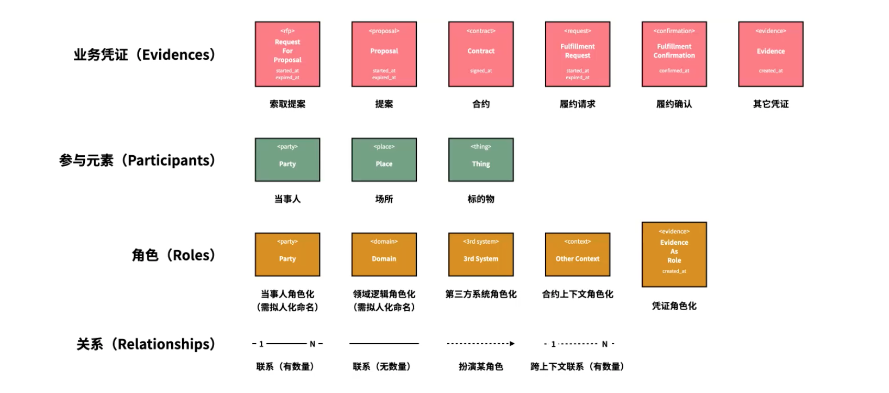
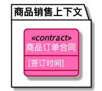
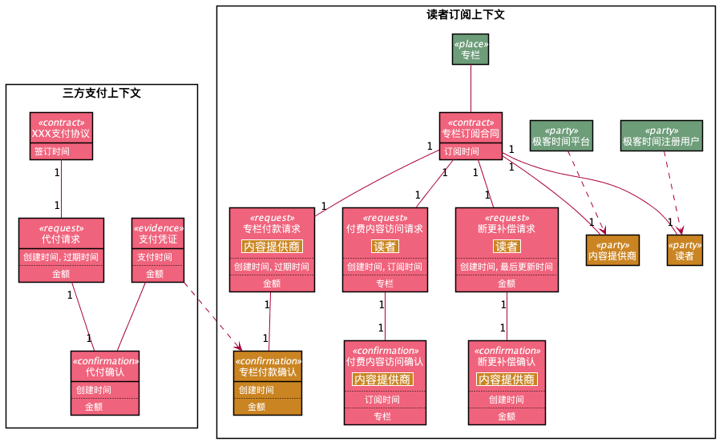
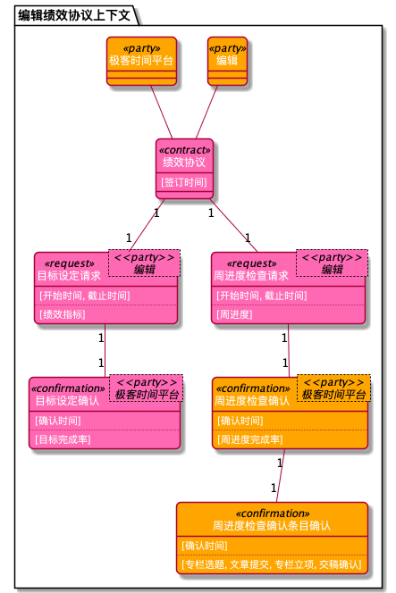
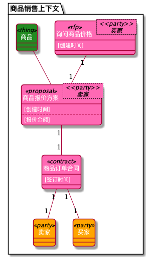
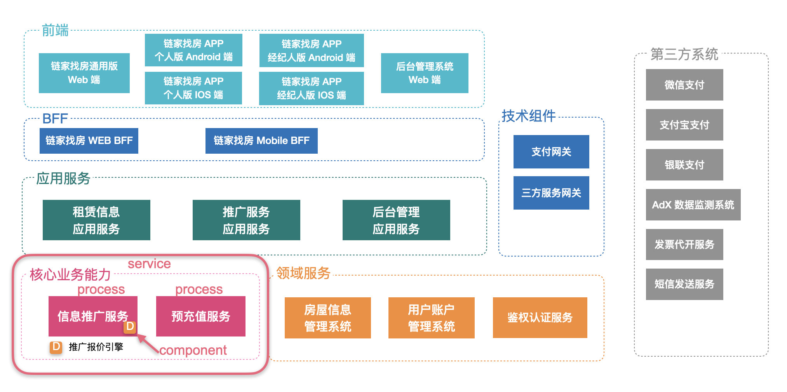
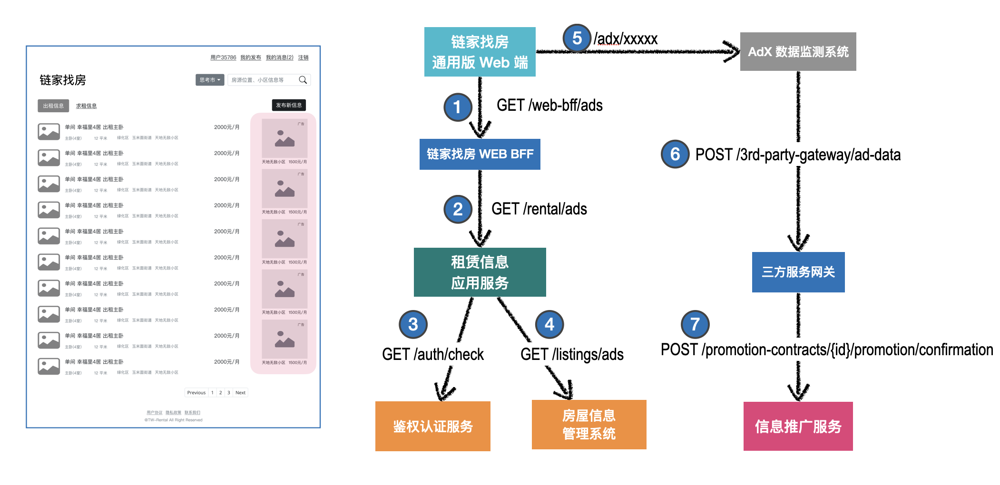
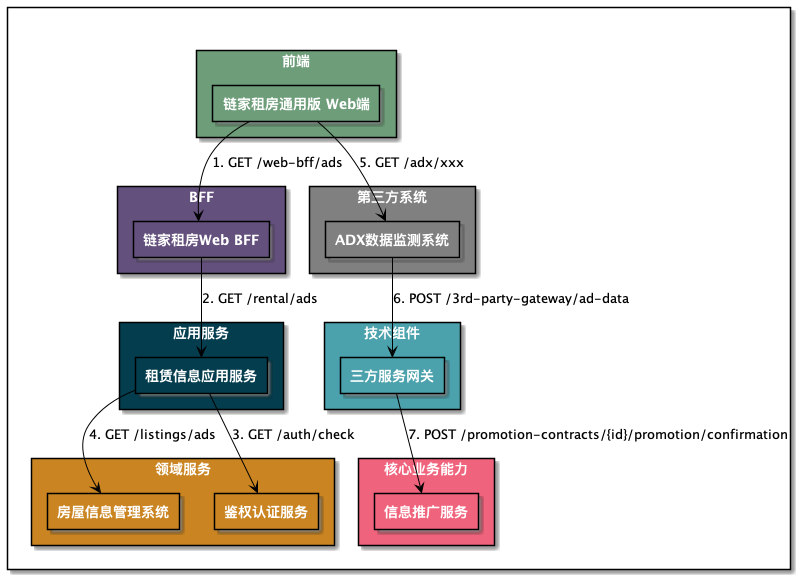
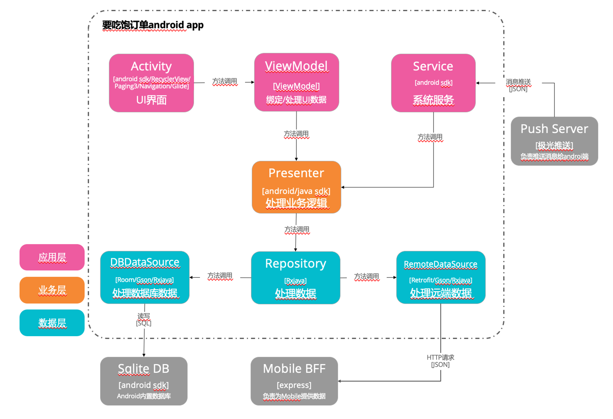
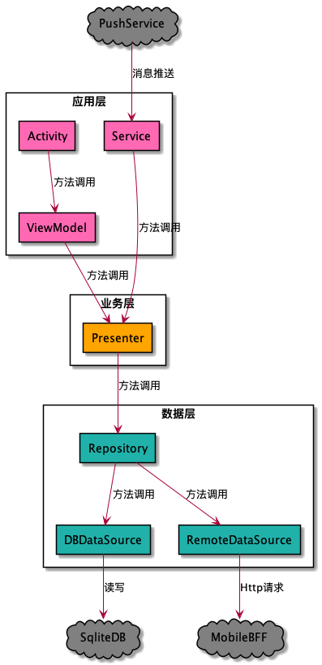

# 8x Flow 业务建模图DSL生成工具

- [8x Flow 业务建模图DSL生成工具](#8x-flow-业务建模图dsl生成工具)
  - [介绍](#介绍)
  - [快速开始](#快速开始)
    - [环境准备](#环境准备)
  - [8x Flow业务建模图](#8x-flow业务建模图)
    - [创建Helloword建模图](#创建helloword建模图)
    - [语法介绍](#语法介绍)
      - [diagram_8x_flow](#diagram_8x_flow)
      - [context](#context)
      - [rfp（非必选）](#rfp非必选)
      - [proposal（非必选）](#proposal非必选)
      - [contract](#contract)
      - [fulfillment](#fulfillment)
      - [participant_xxx](#participant_xxx)
      - [role_xxx](#role_xxx)
      - [凭证创建和凭证角色化](#凭证创建和凭证角色化)
    - [图例](#图例)
  - [进程间(Inter-process)架构图](#进程间inter-process架构图)
    - [创建一个简单进程间架构图](#创建一个简单进程间架构图)
    - [语法介绍](#语法介绍-1)
      - [diagram_inter_process](#diagram_inter_process)
      - [service](#service)
      - [process](#process)
      - [component](#component)
    - [图例](#图例-1)
  - [进程内(Intra-process)架构图](#进程内intra-process架构图)
    - [语法介绍](#语法介绍-2)
      - [diagram_intra_process](#diagram_intra_process)
      - [layer](#layer)
      - [component](#component-1)
      - [process](#process-1)
    - [图例](#图例-2)
  - [后续开发计划](#后续开发计划)
  - [其他](#其他)


## 介绍

手动绘制[8x Flow](https://huhao.dev/posts/2932e594/)业务建模图是低效痛苦，特别是业务频繁变动时，更新业务建模图的成本很高。虽然有一些[8x flow的建模图绘制工具](https://github.com/vincentx/8x-flow)，但是不支持语法检查，并且生成的图不够友好，因此我开发了此工具。此工具基于Kotlin语言，通过友好的自定义DSL生成8xFlow业务建模图。

目前此工具除了支持生成**8x Flow业务建模图**，还支持创建**进程间(inter-process)**和**进程内(intra-process)架构图**。


## 快速开始

### 环境准备

clone [8x-flow-diagram](https://github.com/behring/8x-flow-diagram)的代码到本地后，通过[Intellij Idea](https://www.jetbrains.com/idea/)打开工程，查看`8x-flow-diagram/src/test/kotlin`下的示例代码。

>注意：项目是通过PlantUML API生成建模图，如果生成图例失败，请查看是否安装了[GraphViz](https://plantuml.com/zh/graphviz-dot)


## 8x Flow业务建模图

* **创建时标对象(Evidences)**：包括*方案征集书(RFP)、提案(Proposal)、合约(Contract)、履约请求(Fulfillment-Request)、 履约确认(Fulfillment-Confirmation)、凭证(Evidence)。*
* **创建参与者对象(Participants)**：*包括参与方(Party)、标的物(Thing)、场所(Place)。*
* **创建角色对象(Roles)**：包括*合约中的角色(Role)、领域逻辑角色化(Domain)、第三方系统角色化(3rd System)、凭证角色化(Evidence As Role)。*
* **创建关系**：*关联关系(1对1、1对N、无数量)；扮演角色关系。*  




### 创建Helloword建模图

1. 在`8x-flow-diagram/src/main/kotlin/doxflow/samples`目录下创建`hello-word-diagram.kts`脚本文件。

2. 键入如下代码：

   ```kotlin
   import doxflow.dsl.diagram_8x_flow
   
   diagram_8x_flow {
       context("商品销售上下文") {
           contract("商品订单合同") {
               key_timestamps("签订时间")
           }
       }
   } export "../../../diagrams/hello_word_diagram.png"
   ```

3. 右键该文件运行，在`8x-flow-diagram/diagrams`目录下查看`hello_word_diagram.png`文件。

   

### 语法介绍

#### diagram_8x_flow

用来表示**生成一张8xflow业务建模图**，通过`export`来生成最终png图片。用法如下：

```kotlin
diagram_8x_flow {
   ...
} export "../../../diagrams/hello_word_diagram.png"
```

#### context

用来表示**一个上下文**，一张建模图可以包含多个上下文，可以在上下文中定义**合约中的角色(Role)**，提供给其他图例使用。

```kotlin
diagram_8x_flow {
	context("读者订阅上下文") {
    val reader = role_party("读者")
    val geekTimePlatform = role_party("极客时间平台")
     ...
  }
  context("三方支付上下文") {
     ...
  }
} export "../../../diagrams/hello_word_diagram.png"
```

#### rfp（非必选）

rfp在建模图中**是非必选项**，如果DSL中包含rfp，后续的图例必须包裹在rfp之中（这样就可以区分一个context中多个rfp关联的propsal和contract）。

```kotlin
diagram_8x_flow {
    context("商品销售上下文") {
        val seller = role_party("卖家")
        val buyer = role_party("买家")

        rfp("询问商品价格", buyer) {
          	//指定关键时间，可以传入多个时间，逗号分隔
            key_timestamps("创建时间")
            //指定关键数据项，可以传入多个数据项，逗号分隔
          	key_data("报价")
        }
    }
} export "../../../diagrams/contract_with_rfp_diagram.png"
```

>注意：不能指定rfp和proposal之间的关联关系，默认1对1。

#### proposal（非必选）

proposal在建模图中**也是非必选**，当且仅当**rfp出现时proposal必选**。

```kotlin
diagram_8x_flow {
    context("商品销售上下文") {
        val seller = role_party("卖家")
        val buyer = role_party("买家")

        rfp("询问商品价格", buyer) {
            key_timestamps("创建时间")
            proposal("商品报价方案", seller) {
                key_timestamps("创建时间")
                key_data("报价金额")
								// 可以通过participant_thing来创建标的物，通过relate关键字让标的物连接到当前proposal
                participant_thing("商品") relate this
            }
        }
    }
} export "../../../diagrams/contract_with_rfp_diagram.png"
```

> 注意：不能指定proposal和contract之间的关联关系，默认1对1。

#### contract

contract是建模图中的核心，可以在proposal或者context下包裹。

```kotlin
diagram_8x_flow {
    context("商品销售上下文") {
        val seller = role_party("卖家")
        val buyer = role_party("买家")

        rfp("询问商品价格", buyer) {
            key_timestamps("创建时间")

            proposal("商品报价方案", seller) {
                key_timestamps("创建时间")
                key_data("报价金额")
                participant_thing("商品") relate this
								
              	// 合约可以设置0..N个合约签订者，推荐设置双方合约
                contract("商品订单合同", seller, buyer) {
                    key_timestamps("签订时间")
                  	// 同样，合约也可以设置关键数据
                  	//key_data("关键数据项")
                }
            }
        }
    }
} export "../../../diagrams/contract_with_rfp_diagram.png"
```

#### fulfillment

fulfillment表示**一组履约项**，包含**request**和**confirmation**。我们可以通过`AssociationType`来指定contract和fulfillment之间的对应关系。

```kotlin
import doxflow.common.AssociationType.*
...
 context("读者订阅上下文") {
   // 可以通过play关键字让参与方party扮演角色party
   val reader = participant_party("极客时间注册用户") play role_party("读者") 
   val contentProvider = participant_party("极客时间平台") play role_party("内容提供商")  
   ...
   contract("专栏订阅合同", reader, contentProvider) {
		key_timestamps("订阅时间")
    // 可以通过relate方法设置合同关联的participant
    participant_place("专栏") relate this
     
      fulfillment("专栏付款", ONE_TO_ONE) {
        // request可以指定或者忽略履约角色，但是不建议省略（三方合同可以省略）
 				request(contentProvider) {
          key_timestamps("创建时间", "过期时间")
          key_data("金额")
        }
        // confirmation可以指定或者忽略履约角色，但是不建议省略（三方合同可以省略）
        confirmation(reader) {
          key_timestamps("创建时间")
        }
      }
		}
 }
...
```

#### participant_xxx

participant_xxx可以用来创建参与者，包括如下DSL：

- participant_party
- participant_thing
- participant_place

#### role_xxx

role_xxx可以用来创建角色，包括如下DSL：

- role_party
- role_domain
- role_3rd_system
- role_context


#### 凭证创建和凭证角色化

凭证是通过`evidence`语法创建，目前**仅仅支持在confirmation中创建凭证**。通过`role`方法完成凭证角色化。

```kotlin
diagram_8x_flow {
  // 凭证角色化是跨上下文的，因此需要在diagram_8x_flow下定义需要角色化的fulfillment(其实是fulfillment下的confirmation角色化)
    lateinit var paymentInReaderSubscriptionContext: fulfillment
    
    context("读者订阅上下文") {
       ...
        contract("专栏订阅合同", reader, contentProvider) {
            key_timestamps("订阅时间")
						...

          	// 这里是重点因为该履约项的确认是通过其他上下文的凭证来扮演的，所以需要临时保存
            paymentInReaderSubscriptionContext = fulfillment("专栏付款") {
              request(contentProvider) {
                key_timestamps("创建时间", "过期时间")
                key_data("金额")
              }
              
            	confirmation(reader) {
              	key_timestamps("创建时间")
            	}
            }
        }
    }

    context("三方支付上下文") {
        contract("XXX支付协议") {
            key_timestamps("签订时间")
            fulfillment("代付") {
                request {
                    key_timestamps("创建时间", "过期时间")
                    key_data("金额")
                }

                confirmation {
                    key_timestamps("创建时间")
                    key_data("金额")
										// confirmation完成生成一个凭证(evidence),该凭证将扮演其他上下文履约项的角色
                    val evidence = evidence("支付凭证") {
                        key_timestamps("支付时间")
                        key_data("金额")
                    }
                  	//通过evidence的play关键字指定该evidence需要扮演哪个履约项的角色(这里指定了之前临时保存的fulfillment下的confirmation)
                    evidence play paymentInReaderSubscriptionContext.confirmation
                }
            }
        }
    }
} export "../../../diagrams/reader_subscription_diagram.png"

```

### 图例
- 专栏订阅协议

- 绩效协议

- 商品订单合同



## 进程间(Inter-process)架构图

* **创建服务层(Service)**：*服务层用来表示不同服务所处的层级，例如：前端，BFF，应用服务层，领域服务等等。*
* **创建服务(Process)**：*服务用来表示处于独立进程的业务模块，例如：微信客户端，MobileBFF，鉴权认证服务等等。*
* **创建进程内组件(Component)**：*进程内组件用来表示业务模块内的关键组件，例如：信息推广服务中包含推广报价引擎组件。*

它们三者的关系式：Service包含Procss包含Component。

- 进程间架构图



- 一部分进程间架构交互图



### 创建一个简单进程间架构图

1. 在`8x-flow-diagram/src/main/kotlin/architecture/samples`目录下创建`inter_process_diagram.kts`脚本文件。

2. 键入如下代码：

   ```kotlin
   import architecture.diagram_inter_process
   
   diagram_inter_process {
     	// 颜色可以省略，也可以通过#ffffff方式自定义颜色
       service("应用服务", "#LightSeaGreen") {
           process("租赁信息应用服务")
           process("推广服务应用服务")
           process("后台管理应用服务")
       }
   
       service("核心业务能力", "#HotPink") {
           process("信息推广服务") {
               component("推广报价引擎", "#orange")
           }
           process("预充值服务")
       }
   
       service("领域服务", "#orange") {
           process("房屋信息管理系统")
           process("用户账户管理系统")
       }
   
       service("第三方系统", "#gray") {
           process("微信支付")
           process("支付宝支付")
           process("银联支付")
           process("ADX数据监测系统")
           process("发票代开服务")
           process("短信发送服务")
       }
   } export "./diagrams/inter_process_diagram.png"
   ```

3. 右键该文件运行，在`8x-flow-diagram/src/main/kotlin/architecture/samples/diagrams`目录下查看`inter_process_diagram.png`文件。

   

### 语法介绍

#### diagram_inter_process

用来表示**生成一张进程间架构图**，通过`export`来生成最终png图片。用法如下：

```kotlin
diagram_inter_process {
   ...
} export "../../../diagrams/inter_process_diagram.png"
```

#### service

用来表示不同服务所处的层级。**内部必须包含process**。

#### process

用来**表示处于独立进程的业务模块**。**可以和其他process进行交互**。用法如下：

```kotlin
diagram_inter_process {
		service("前端", "#Cyan") {
      	// 可以让前端的中的“链家租房通用版Web端”组件通过call方法调用BFF的“链家租房WebBF”组件
        process("链家租房通用版Web端").call("链家租房WebBFF","1. GET /web-bff/ads")
    }
  	service("BFF", "#RoyalBlue") {
        process("链家租房WebBFF")
				process("链家租房MobileBFF")
    }
  } export "./diagrams/lianjia_inter_process_communication_diagram.png"

```

#### component

用来表示**业务模块内的关键组件**，**必须包含在process内部**。用法如下：

```kotlin
diagram_inter_process {
    service("核心业务能力", "#HotPink") {
        process("信息推广服务") {
          	// 在业务模块内部定义关键组件
            component("推广报价引擎", "#orange")
        }
        process("预充值服务")
    }
} export "./diagrams/inter_process_diagram.png"
```

### 图例




## 进程内(Intra-process)架构图

* **创建分层(Layer)**：*分层用来表示进程内架构中的层。例如：应用层，业务逻辑层，数据层等*
* **创建组件(Component)**：*组件用来表示每一层包含的组件。*
* **创建进程外服务(Process)**：*用来表示进程外服务。*

- 进程内架构图

  

### 语法介绍

#### diagram_intra_process

用来表示**生成一张进程内架构图**，通过`export`来生成最终png图片。用法如下：

```kotlin
diagram_intra_process {
   ...
} export "../../../diagrams/intra_process_diagram.png"
```

#### layer

用来表示进程内架构分层。**内部必须包含component**。

```kotlin
diagram_intra_process {
  	//	定义应用层包含哪些组件
     layer("应用层", "#HotPink") {
        component("Activity")
        component("ViewModel")
        component("Service")
    }
} export "./diagrams/intra_process_diagram.png"
```


#### component

用来表示**进程内的组件**，**必须包含在layer内部**。**组件可以和其他组件(component)以及进程外服务(process)交互**。用法如下：

```kotlin
diagram_inter_process {
     layer("应用层", "#HotPink") {
       // 通过call方法完成组件的调用，call方法参数1是组件名，参数2是调用的描述(optional)
        component("Activity").call("ViewModel", "方法调用")
        component("ViewModel").call("Presenter", "方法调用")
        component("Service").call("Presenter", "方法调用")
    }
      layer("业务层", "#orange") {
        component("Presenter")
    }
} export "./diagrams/intra_process_diagram.png"
```

#### process

用来**表示进程外服务**。**可以和进程的内的component进行交互**。来表示进程边界的调用关系。用法如下：

```kotlin
diagram_intra_process {
    layer("应用层", "#HotPink") {
        component("Activity").call("ViewModel", "方法调用")
        component("ViewModel").call("Presenter", "方法调用")
        component("Service").call("Presenter", "方法调用")
    }

    layer("业务层", "#orange") {
        component("Presenter").call("Repository", "方法调用")
    }

    layer("数据层", "#LightSeaGreen") {
        val repo = component("Repository")
        repo.call("DBDataSource", "方法调用")
        repo.call("RemoteDataSource", "方法调用")
        // DBDataSource组件会调用系统的DB来读写数据
        component("DBDataSource").call("SqliteDB", "读写")
        // RemoteDataSource组件会调用进程外的BFF来获取数据
        component("RemoteDataSource").call("MobileBFF", "Http请求")
    }

  	// 进程外的push服务会调用进程内的service来推送消息
    process("PushService").call("Service", "消息推送")
    // 进程外的BFF服务
    process("MobileBFF")
    // 进程外的系统数据库
    process("SqliteDB")

} export "./diagrams/intra_process_diagram.png"

```

### 图例



## 后续开发计划
- 生成合约分析中的凭证。DONE
- 通过合约分析中的凭证生成合约文本。DONE
- 通过合约文本中的权责关系(request,confirmation)生成基础8xflow建模图DSL。TODO
- 通过8xflow建模图DSL修改添加参与方、三方系统、凭证角色化等信息生成最终8xflow建模图。 DONE
- 通过8xFlow建模图的履约项生成API文档。DONE
- 生成进程间架构图。DONE
- 生成进程内架构图。DONE
- 集成内架构测试策略。TODO
- 通过进程内架构和测试策略生成工序。TODO
- 通过DSL编写Story并和工序关联。TODO

## 其他

如果有问题，可以[邮箱联系](mailto:lizhao@thoughtworks.com?subject=8xFlow建模图工具反馈)。

